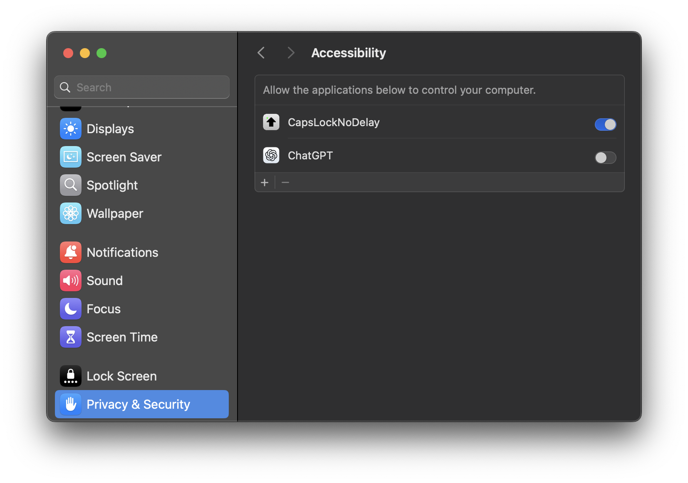

# CapsLockNoDelay
Removes annoying delay when pressing the caps lock on Mac OS.

Confirmed working on MacOS Sequoia 15.6

## Built-in Alternative
Turns out there is a built-in alternative for deactivating the CapsLockDelay.
Thanks @decodism for pointing that out!
```bash
hidutil property --set '{"CapsLockDelayOverride":0}'
```
Just run this, no other steps are needed.

If that doesn't work, continue with the regular installation.

# Install
### Manual

Download from [releases](https://github.com/gkpln3/CapsLockNoDelay/releases) or compile from source.

Copy CapsLockNoDelay.app to `/Applications` folder.

### Homebrew

To install it using Homebrew, open the Terminal app and type:
```bash
brew install --cask capslocknodelay
```

### Usage

1. Go to `System Preferences` -> `General` -> `Login Items`, add `CapsLockNoDelay.app` to the list.


2. Go to `System Preferences` -> `Privacy & Security` -> `Accessibility` , add `CapsLockNoDelay.app` to the list (if not already present), check `CapsLockNoDelay.app`.



In older versions of MacOS, go to `System Preferences` -> `Security & Privacy` -> `Privacy` -> `Accessibility` -> Check `CapsLockNoDelay.app` -> `Input Monitoring` -> check `CapsLockNoDelay.app` (if present).


You will not see any settings / GUI, the app is running in the background (you can see it in Activity Monitor).
